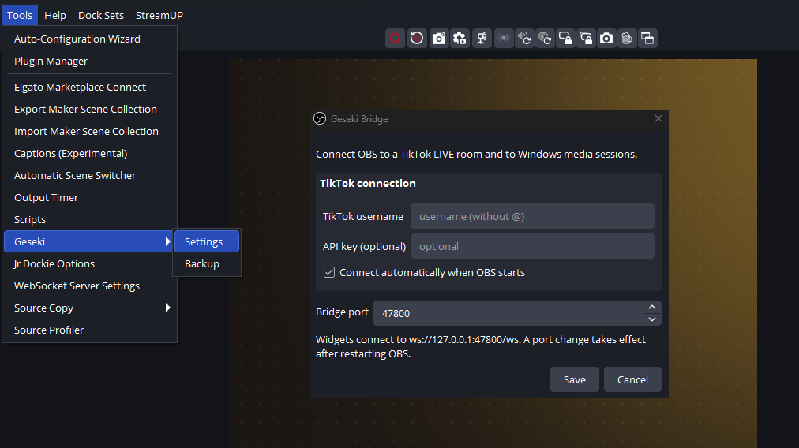

# Geseki Bridge

One OBS plugin for local services [Sekisungkarak](https://github.com/sekisungkarak) stream widgets

```
ws://127.0.0.1:47800/ws
```



The wire contract lives in [`docs/protocol.md`](docs/protocol.md) — read it
first.

## Why one plugin

* **One port.** A single loopback listener (WebSocket + a small HTTP surface).
* **SMTC needs no extra runtime.** Windows media sessions are read natively via
  WinRT inside the plugin; there is no tray app to install or keep running.
* **TikTok without a second port.** A small Go sidecar speaks
  newline-delimited JSON over **stdin/stdout**, so nothing extra is exposed.
* **Native dialogs.** *Tools → Geseki → Settings* edits the TikTok settings,
  and *Tools → Geseki → Backup* backs up the plugin's config. Qt is linked from
  OBS — nothing Qt is bundled.
* **Active Audio Sources page.** `http://127.0.0.1:47800/sessions` lists the
  app ids of every active Windows media session — the same content the old SMTC
  Bridge `/sessions` page showed.

## TikTok connection

Nothing extra to install: connect your username in *Settings* and TikTok works
on the next OBS start.

| Path | How | Needs |
| --- | --- | --- |
| **Primary** | Connects directly, no signing step on this machine | nothing |
| **Fallback: Euler Stream** | Used only if the primary path fails; an optional API key raises its rate limit | nothing |

## HTTP surface

| Method | Path | Purpose |
| --- | --- | --- |
| `GET` | `/health` | liveness probe |
| `GET` | `/bridge-port` | port discovery (also on the fixed port `47800`) |
| `GET` | `/now-playing` | the current `nowplaying` payload (SMTC-Bridge compatible) |
| `GET` | `/artwork/<app_id>?v=<n>` | cached cover art |
| `GET` | `/sessions` | **Active Audio Sources** page (live list of media sessions) |
| `POST` | `/save?name=<file>` | write the request body into the real Downloads folder |

`POST /save` exists because widget pages cannot write files inside OBS
(`obs-browser` installs no CEF download handler), so exports — CSV and JSON —
are POSTed here and the native side writes them. A colliding name gets a ` (1)`
suffix, and a path in `name` is reduced to its base name.

Because `GET /now-playing` matches the old SMTC Bridge schema, an existing
now-playing widget only needs its port changed to `47800` — no code change.

## Install

Two downloads are published for Windows:

| Asset | Use it when |
| --- | --- |
| `geseki-bridge-<version>-windows-installer.zip` | **Easiest.** Unzip, run the `.exe`, done — it finds your OBS and copies the files in. |
| `geseki-bridge-<version>-windows-x64.zip` | Manual install (e.g. a portable OBS you want to keep self-contained). |

### Option A — installer (recommended)

1. Download `geseki-bridge-<version>-windows-installer.zip` and unzip it.
2. Run `geseki-bridge-<version>-windows-installer.exe`. It auto-detects your
   OBS folder (the `HKLM\SOFTWARE\OBS Studio` registry value written by the
   official installer, falling back to `C:\Program Files\obs-studio`) — or
   browse to a **portable** OBS folder when prompted.
3. Restart OBS.

### Option B — manual zip

The zip mirrors the OBS folder tree, so there is **no folder to guess** — you
extract it straight into OBS.

1. Grab `geseki-bridge-<version>-windows-x64.zip` from
   [Releases](../../releases).
2. Extract it into your **OBS install folder** (the one containing
   `obs64.exe`). The zip contains `obs-plugins/` and `data/`; merging them
   gives:
   ```
   <OBS>\obs-plugins\64bit\geseki-bridge.dll
   <OBS>\obs-plugins\64bit\geseki-bridge-tiktok.exe
   <OBS>\data\obs-plugins\geseki-bridge\locale\en-US.ini
   ```
   * **Portable OBS:** just unzipped into the OBS Folder
   * **Installer OBS:** `C:\Program Files\obs-studio` — copy `obs-plugins\`
     and `data\` into it and approve the admin prompt.
3. Restart OBS. A **Geseki** item appears under *Tools*, holding **Settings**
   and **Backup**.

## License

GPL-2.0-or-later (see [`LICENSE`](LICENSE)) — the same license OBS itself uses,
and required for the `obs-frontend-api` linkage.

The Go sidecar depends on
[`steampoweredtaco/gotiktoklive`](https://github.com/steampoweredtaco/gotiktoklive),
which is **MIT** licensed.
